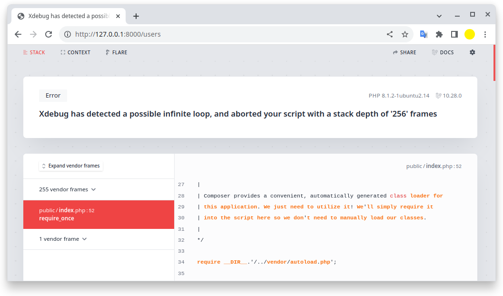

# laravel10-circular-reference-example


```sh
$ composer install
$ XDEBUG_MODE=develop php artisan serve

   INFO  Server running on [http://127.0.0.1:8000]. 

   Press Ctrl+C to stop the server
```

(or `XDEBUG_MODE=off php artisan serve`)


http://127.0.0.1:8000/users:  

